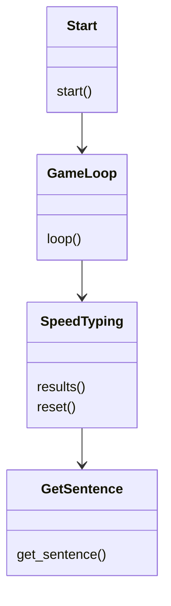
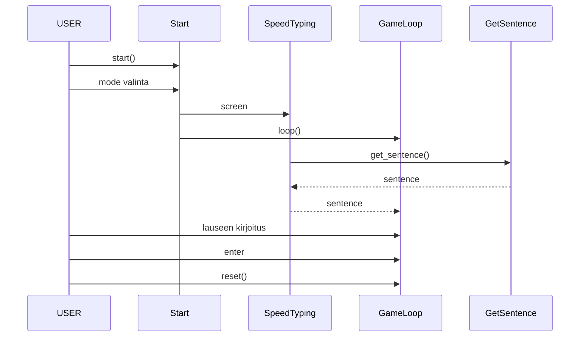

## Käyttöliittymä

Sovelluksessa on neljä näkymää:
- Aloitus, jossa valitaan kumpi taso halutaan
- Virallinen aloitusnäkymä, josta käyttäjä pääsee aloittamaan pelin.
- Pelin alku, jossa näkyy lause, joka hänen täytyy kirjoittaa.
- Näkymä, jossa näkyy käyttäjän kirjoittamisen tulokset, sekä reset-nappi, joka paluttaa pelin uudestaan pelin alku näkymään.

## Luokkakaavio

Sovelluksen luokkakaavio kuvaa sovelluksen luokkien yhteyttä toisiinsa.

## Sekvenssikaavio

Tämä sekvenssikaavio kuvaa pelin aloitusta ja yleistä toimintaa siitä alkaen, kun peli haetaan komennolla poetry run invoke start.

