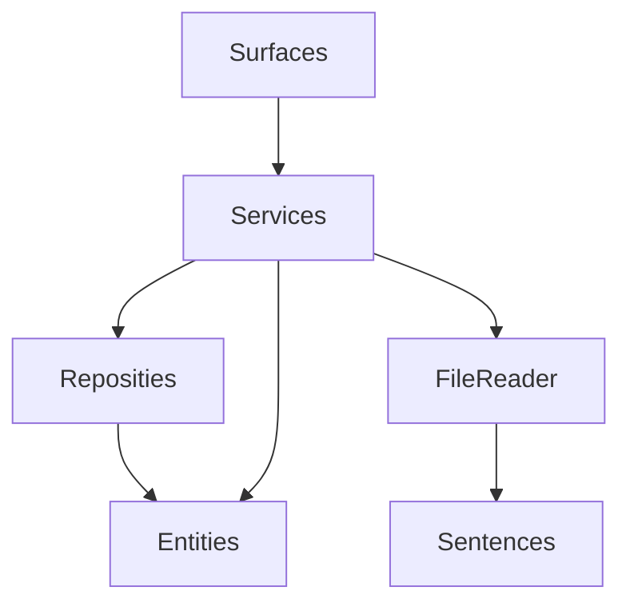
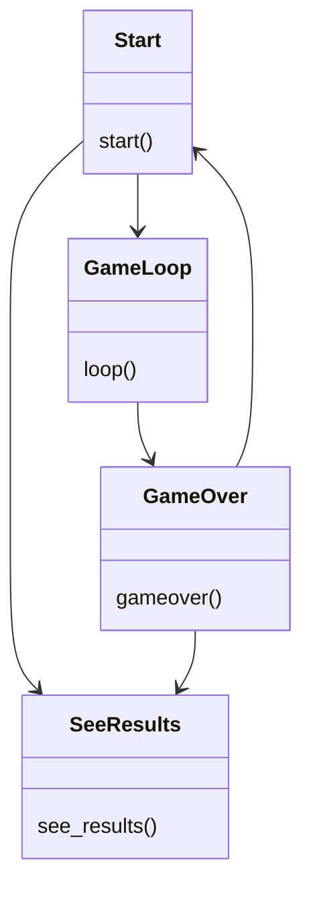
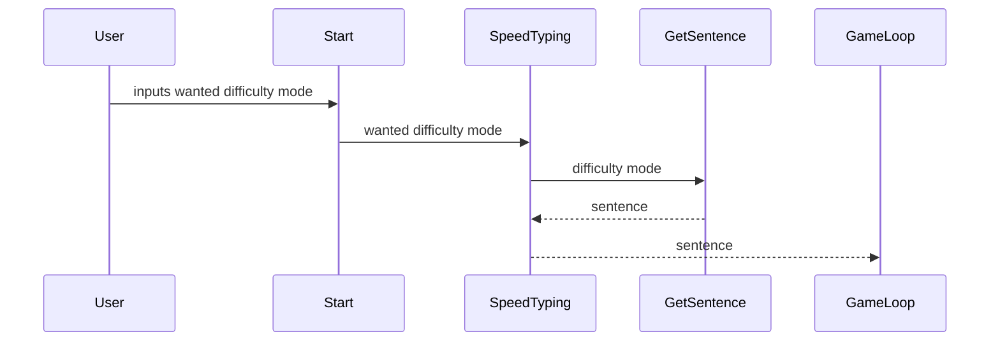
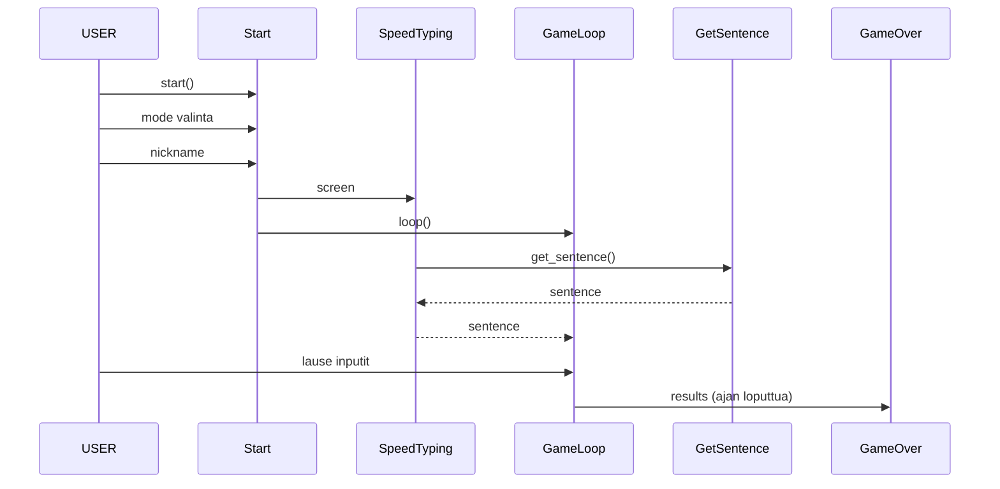
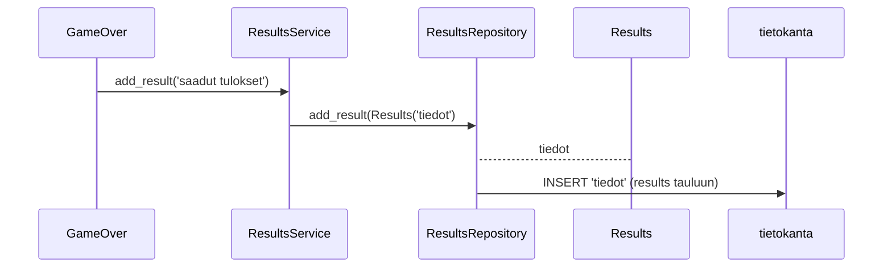

# Arkkitehtuurikuvaus

## Rakenne

Seuraava kaavio kansioden rakennetta src-tiedostossa. Surfaces sisältää sovelluksen eri näkymien pygame -loopit, Services sisältää sovelluslogiikasta huolehtivan osan, FileReader sisältää koodin osan, joka lukee tarvittavan tiedon kansioista, Reposities sisältää koodin tietokannan pysyväistallennukseen ja Entities sisältää Results-olion, joka tallennetaan tietokantaan. Sentences kansiossa on kansiot, joista peli hakee lauseet, joita tulee kirjoittaa.

Lisäksi koodissa on 

## Käyttöliittymä

Sovelluksessa on viisi näkymää:
- Aloitus, jossa valitaan kumpi taso halutaan.
- Toinen aloitusnäkymä, jossa annetaan pelaajan lempinimi, ja sitten aloitetaan peli.
- Itse peli, joka antaa käyttäjälle lauseita, ja johon ne tulee kirjoittaa. Näkymä näkyy pelin eli 40 s ajan.
- Pelin loppu näkymä, joka kertoo käyttäjälle pelin tulokset.
- Tulos näkymä, jossa näkyy 12 edellistä pelitulosta.

## Surfaces -luokkakaavio

Seuraava luokkakaavio kuvaa pelin eri näkymien (joilla on omat luokkansa) suhdetta toisiinsa, ja sitä, miten ne kutsuvat toisiaan. Näkymät kuvaavat pelin eri käyttöliittymiä, joita kuvattu käyttöliittymäkohdassa.

(Jostain syystä nuoli Startista SeeResultsiin hieman leikkaantuu, hyvä huomata, että se on siellä.

### Heikkoudet

Surfaces luokissa on aika paljon toisteisuutta toistensa kanssa, ja varmaan olisi ollut parempiakin tapoja rakentaa nämä.

## Pysyväistallennus

Ohjelma tallentaa jokaisen loppuun asti pelatun pelin eri tulokset, pelaajan lempinimen sekä pelin vaikeustason tietokantaa results -tietokantatauluun. Tietokantana toimii SQLite.

## Sekvenssikaavioita sovelluksen eri ominaisuuksista

### Sekvenssikaavio tiedostojen luvusta

Seuraava sekvenssikaavio kuvaa sitä, miten peli lukee tiedostoja sentences_normal.txt ja sentences_hard.txt. Start ja Gameloop ovat Surfaces kansiossa, SpeedTyping on Services kansiossa, GetSentence on FileReader kansiossa ja luettavat kansiot Sentences kansiossa.

### Sekvenssikaavio yhdestä pelatusta pelistä

Tämä sekvenssikaavio kuvaa pelin aloitusta ja yleistä toimintaa siitä alkaen, kun peli haetaan komennolla poetry run invoke start. (Tämä ilman, että käyttäjä katsoo missään vaiheessa edellisiä tuloksia, tämä vain pelkkä peli).

### Sekvenssikaavio pelituloksen tallentumisesta tietokantaan

Seuraava sekvenssikaavio kuvaa tiedon tallentumista tietokantaan. Edellisestä sekvenssikaaviosta nähdään kuinka pelitulos on tullut GameOver surface luokkaan.

