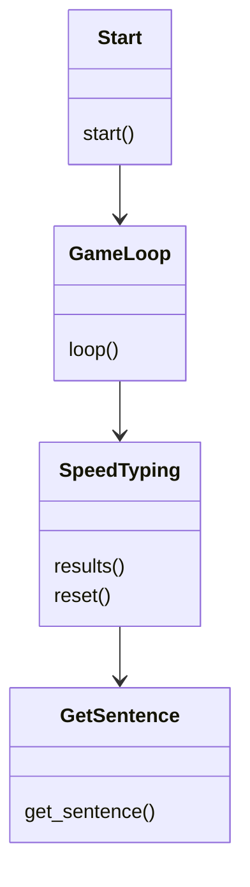
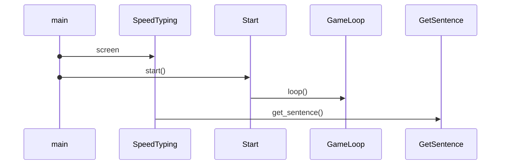

## Luokkakaavio

```mermaid
 classDiagram
      Start --> GameLoop
      GameLoop --> SpeedTyping
      SpeedTyping --> GetSentence
      class Start{
          start()
      }
      class GameLoop{
          loop()
      }
      class SpeedTyping{
          results()
          reset()
      }
      class GetSentence{
           get_sentence()
      }
```

## Sekvenssikaavio

```mermaid
sequenceDiagram
     main()->>SpeedTyping: screen
     main()->>Start: start()
     Start->>GameLoop: loop()
     SpeedTyping->>GetSentence: get_sentence()
```
