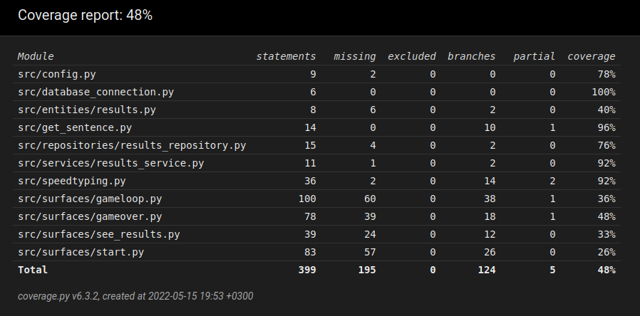

# Testausdokumentti
Peliä on testattu automasoidusti unittestin avulla sekä käsin järjestelmätasolla.

## Unittest
### Testauskattavuus
Sovelluksen unittestien testikattavuus on 48 prosenttia

Tietokannan ja siihen liittyvien tiedostojen testaus jäi tekemättä.

### Sovelluslogiikka
Sovelluslogiikka on testattu speedtyping_test.py luokassa.

## Järjestelmätestaus
Sovellus on testattu käyttöohjeiden mukaan Linux-ympäristössä. Kaikki määrittelydokumentin toiminnallisuudet on testattu. 
Käyttäjä ei voi antaa tyhjää syötettä pelissä, sekä hänen antamansa lempinimi tulee olla 4-10 merkkiä pitkä, tai peliä ei pääse aloittamaan.

# Testauksen heikkoudet
Testikattavuus jäi harmillisen vajaaksi ajan puutteen vuoksi. Tärkeää olisi ollut testata ainakin database-asiat.
